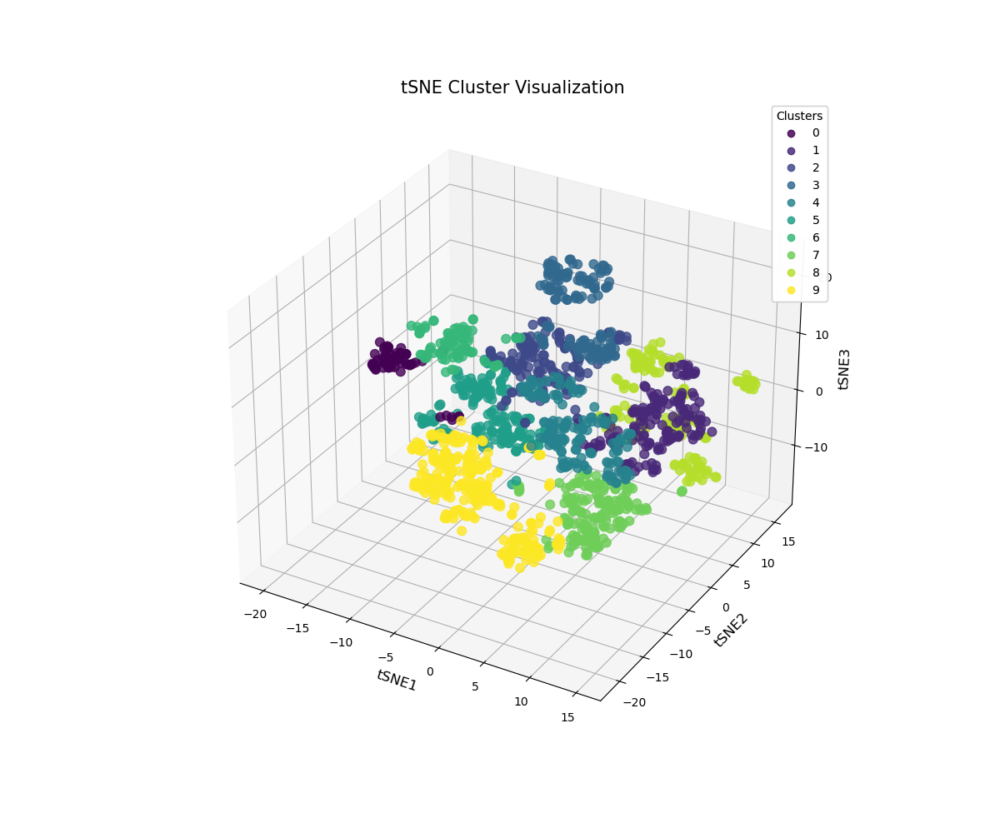
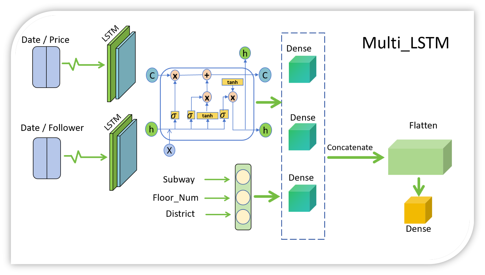

# BeijingHousingPrice Project

## Contributors

| Contributor    | Area(s) of Work          | Description                                                                                                                                          |
|----------------|--------------------------|------------------------------------------------------------------------------------------------------------------------------------------------------|
| Chen Waner     | Data Visualization       | Focused on visualizing data to uncover patterns and insights.                                                                                         |
| Li Ruifeng     | Modeling, Visualization  | Responsible for developing models to forecast prices and also contributed to data visualization. [GitHub](https://github.com/Ruibao996)                 |
| Liu Yuji       | Data Visualization       | Worked on creating visual representations of the data, enhancing the readability and interpretability of the results.                                  |
| Ma Boying      | Data Visualization       | Contributed to the visualization aspect, ensuring the data is presented in a clear and understandable manner.                                           |


## Introduction
This project involves data processing, clustering, and forecasting housing prices in Beijing. We primarily use **PCA** and **K-means** for clustering and a **multi_lstm** model to forecast prices.

## Project Structure

PROJECT_ROOT <br>
|  <br>
|---data <br>
| &emsp; | <br>
|  &emsp;  |---csv <br>
|  &emsp;  |---process.py <br>
|   <br>
|---model <br>
|    &emsp; | <br>
|    &emsp; |---kmeans.py <br>
|    &emsp; |---linear_relationship.py <br>
| &emsp;   |---multi_lstm_train.py <br>
| &emsp;   |---multi_lstm_predict.py <br>
| &emsp;   |---model_visualization.py <br>
|    <br>
|---result <br>
| &emsp;   | <br>
| &emsp;   |---data <br>
| &emsp;   |---model <br>
|  &emsp;  |---picture <br>
| <br>
|---tool <br>
|  &emsp;  | <br>
|  &emsp;  |---dimension_reduce.py <br>
|  &emsp;  |---relation.py <br>
| <br>
|---README.md <br>
|---README.pdf <br>
|---cluster.py <br>
|---main_train.py <br>
|---main_predict.py <br>
|---requirements.txt <br>
|---visualization.ipynb 


## Data
The data used is housing price data from Beijing, sourced from [Kaggle](https://www.kaggle.com/datasets/ruiqurm/lianjia). It includes information on price, area, location, layout, and more. The data is provided in CSV format. We use [empirical rule](https://en.wikipedia.org/wiki/68%E2%80%9395%E2%80%9399.7_rule) to remove outliers and ensure the data is clean and reliable.

## Methods
### Clustering
We use machine learning model [t-SNE](https://en.wikipedia.org/wiki/T-distributed_stochastic_neighbor_embedding) to reduce the dimensionality of the data, followed by [K-means](https://en.wikipedia.org/wiki/K-means_clustering) for clustering,besides, we also use [Elbow Method](https://en.wikipedia.org/wiki/Elbow_method_(clustering)) and [Silhouette Method](https://en.wikipedia.org/wiki/Silhouette_(clustering)) to help us optimize the cluster_num. The number of clusters is determined using the elbow method, which assesses the change in inertia to find the optimal number of clusters. 

After clustering, we analyze the number of houses and total earnings within each cluster to identify the most profitable clusters.


### Forecasting
#### Data Preprocessing
1. Fill missing values with the mean.
2. Normalize the data using **MinMaxScaler**.
3. Apply a 7-day rolling average to smooth the data.

#### Model
We use a multi_lstm model to forecast prices. The architecture of the model is as follows:


You can also view the [details](./result/picture/lstm_model_visualization.png) of the model.
The model consists of two LSTMs, one for **followers** and one for **price**. The outputs of the two LSTMs are concatenated and fed into a dense layer to predict the price. The advantage of this model is its ability to incorporate followers' information, which is a critical factor in predicting prices. Followers represent the number of people interested in a property, which can significantly influence its price.

## Installation
1. Clone the repository.
2. Install the required packages:
    ```bash
    pip install -r requirements.txt
    ```

## Usage
1. **Data Processing**: Run the scripts in the `data` directory to preprocess and clean the data. You can skip this since we have already make it to you.
   
    ```bash
    python data/process.py
    ```
2. **Clustering**: Use the clustering scripts to analyze and segment the data.
    ```bash
    python cluster.py
    ```
3. **Model Training**: Train the multi_LSTM model using the provided training script. If you want to use the model we have trained, you can skip this step.
   
    ```bash
    python main_train.py
    ```
4. **Price Prediction**: Predict future housing prices.
   
    ```bash
    python main_predict.py
    ```

## Results
The results of the clustering and forecasting are stored in the `result` directory. This includes data files, trained models, and visualizations. For example, the following plot shows the original and predicted prices:


## Visualization
The `model` directory contains scripts for visualizing the data and model architecture. You can run the following script to visualize the model architecture:

```bash
run visualization.ipynb
```

This will generate a interact graph by [pygwalker](https://kanaries.net/pygwalker), here are the svg we have generated:


## Future Work
Future improvements could include:
- Incorporating additional features such as economic indicators.
- Exploring different models and architectures.
- Conducting a more thorough hyperparameter tuning process.

## Contact
For any questions or contributions, please contact the project contributors through their GitHub profiles.
